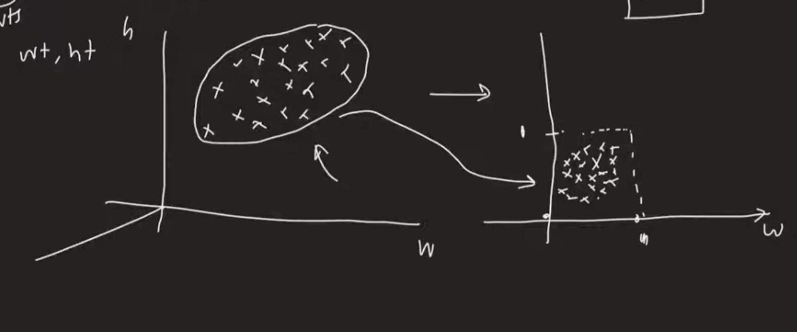

# Normalisation

Rescales all features to a fixed range, usually [0, 1], without changing the relative distances between values.

---

## Types of Normalisation
1. MinMax Scaling
2. Mean Normalisation
3. Max Absolute Scaling
4. Robust Scaling

---

## 1. MinMax Scaling

### Geometrical Intuition

Unit square or rectangle - we need to squish the entire data into this shape if data is along 2 axes (x,y), and into a cube in case of 3 axes.



### Mathematical Formula

**Min-Max Normalization:**

```
x' = (x - x_min) / (x_max - x_min)
```

Where:
- `x` → Original value
- `x_min` → Minimum value of the feature
- `x_max` → Maximum value of the feature  
- `x'` → Normalized value (between 0 and 1)

### Key Points

- **Range**: Always scales values to [0, 1]
- **Preserves relationships**: Maintains the relative distances between data points
- **Sensitive to outliers**: Extreme values can compress the rest of the data
- **Use when**: You need bounded values or when features have different units/scales

---

## Outliers: The Biggest Enemy of Min-Max Scaler

### What is an Outlier?

A data point significantly different from the majority. Can be extremely high or extremely low.

### Example (Titanic Fare Column):

| Passenger | Fare |
|-----------|------|
| 1         | 7.5  |
| 2         | 10   |
| 3         | 12   |
| 4         | 14   |
| 5         | 15   |
| 6         | 20   |
| 7         | 512  | ← **Outlier** (1st-class luxury ticket)

### Problem

Min-Max scaling uses min and max values, so one extreme value drastically changes the scale for all other data points.

#### Comparison: With vs Without Outliers

**Without Outliers:**
- Normal values nicely spread across [0,1]
- Good distribution and separation

**With Outliers:**
- Bulk of data compressed near 0, outlier stretches the scale
- Differences among normal fares are almost invisible
- Algorithms may treat these points as nearly identical

### Impact on Machine Learning Algorithms

#### Distance-based Models (KNN, Clustering, SVM with RBF)
- Distances dominated by outliers
- Normal data points look almost identical → poor clustering or misclassification

#### Neural Networks
- Weights update based on normalized input
- Squashed inputs → small gradients → slower training or vanishing gradients

#### PCA / Dimensionality Reduction
- Variance dominated by outliers → first principal component aligns with extreme points
- Core data structure ignored