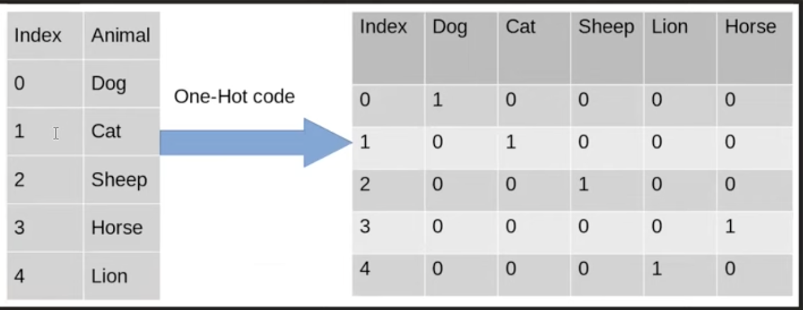

# Feature Engineering
- Process of extracting Features from raw data using domain knowledge

"One imp thing about feature engineering is that if u feed good features to a poor algorithm and if u feed poorly selected features for a good algo the prior will outperform the later"

---

## ML Model Lifecycle

Data processing ---> Feature engineering* ---> Algorithm

---

## Feature Engineering

1. Feature Transformation - input column is tranformed to some other form so that it performs better
    - Missing value imputation 
        - filling out missing values in dataset 
        - by mean, median in case of numerical 
        - by most frequent value in case of categorical dataset
    - Handling categorical features (one hot encoding)
    
    - Outliers detection
        - it is imp to remove outliers as there are few algo which are highly influenced by outliers (Linear Regression)
    - Feature scaling
2. Feature construction
3. Feature selction
4. Feature extraction- given features se koi naye feature ko extract krna programtically not manually as in case of feature constrction while dealing with high dimensional data
    - PCA
    - LDA
    - Tsne
